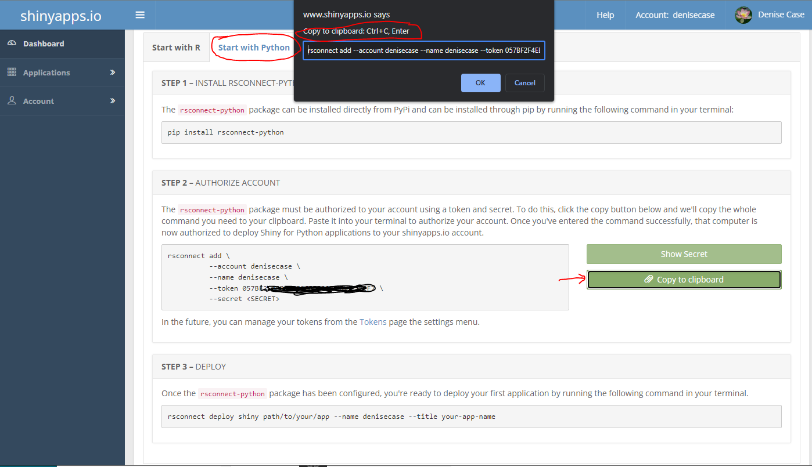

# Getting Started with Shiny for Python

With the advent of WASM (Web Assembly), it is possible to run Python in the browser.
We can write logic for interactive apps using Python instead of JavaScript.

Shiny is the most popular interactive web app framework for R (another popular data science language) and recently became available for Python. 

To learn more about how it compares to other popular options, check out this 16 min video on [YouTube](https://www.youtube.com/watch?v=LDd2ao5KjKM).

-----

## Step 1: Set Up Major Tools (Python and ShinyApps.io)

If you used VS Code to clone your repository/repo, it may still be open to this repo folder.
If not, open VS Code and open the folder containing your repo.

In VS Code, use Terminal / New Terminal to open a terminal window.
Use PowerShell on Windows, Terminal on Mac/Linux.
Type the following command in the terminal and hit Enter to run it. 

```shell
python --version
```

If that does not work, try `python3 --version` or `py --version`. 
Use the command that works instead of `python` in the following instructions. 

🚀 Rocket Tip: Modify this README.md file to reflect the commands that work on your machine. 

### 1A Install and Upgrade Python Tools Globally

Install some additional content into your global Python for best results. 
Open a terminal (PowerShell on Windows, Terminal on Mac/Linux) and run the two commands below to install these to the default Python.
Wait for each command to finish before running the next one.
We need the current `rsconnect-python` to deploy our app to shinyapps.io.

```shell
python -m pip install --upgrade pip wheel
python -m pip install --upgrade git+https://github.com/rstudio/rsconnect-python.git
```

🚩 You must have `reconnect-python` installed globally before continuing.

### 1B Authorize shinyapps.io

Shiny offers a free service for hosting Shiny apps. 
It's pretty easy to use. There's this one-time setup to authorize your machine to use it. It's not bad - just follow these instructions.

1. Using a web browser (I use Chrome), sign in to your free shinyapps.io account.I sign in using GitHub (we'll sign in often and the convenience helps).
1. On the Getting Started page, click on the "Start with Python" tab. 
1. Click "Show Secret"
1. Click "Copy to Clipboard". Follow the instructions. Mine said:
1. Hit Ctrl c / ENTER to copy the provided command to the clipboard. 
1. Open a terminal. (Terminal on Mac/Linux, PowerShell on Windows).
1. Click in the terminal to paste the command and hit ENTER to run it.



-----

## Step 2: Prepare Virtual Environment

We'll set up a local Python environment with the packages we need for this project in the repository folder on our machine. 
To prepare a virtual environment, we must A) **create** a local virtual environment, B) **activate** it, and C) **install** the necessary packages.

There's a short version of A, B, and C for experienced people. 
If new to Python and virtual environments, please skip to the sections 2A, 2B, and 2C below. 

Short version: Open a PowerShell terminal in the **cintel-02-app** folder on your machine. 
Run one command at at time and wait for each to finish before running the next one.

```shell
python -m venv .venv
.venv\Scripts\activate
python -m pip install --upgrade pip wheel
python -m pip install --upgrade -r requirements.txt
```
 
If new to Python and virtual environments - or if not using PowerShell - please refer to sections 2A, 2B, and 2C below. 

### 2A Create a Virtual Environment

The command `python -m venv .venv` creates a virtual environment in a folder named .venv.
If it works correctly, you will see a new folder named .venv.
A leading dot is typically used for items hidden by default.
As an analyst and dashboard developer, be sure you can see hidden folders and files on your machine. 

When VS Code asks if it should create the virtual environment, click yes.

🚀 Rocket Tip: Always read VS Code suggestions, they are often very good. Consider using them. 

### 2B Activate the Virtual Environment

Activate the virtual environment just created. 
After activating it, notice how the prompt changes to show the active virtual environment (.venv). 

- In PowerShell, use `.venv\Scripts\activate`
- On macOS/Linux: `source .venv/bin/`

### 2C Install Libraries into Active Virtual Environment

Install the additional free code we need into the active virtual environment. Run on command at a time, waiting for each to finish before running the next one.

```shell
python -m pip install --upgrade pip wheel 
python -m pip install --upgrade -r requirements.txt
```

It may take a while. Don't worry too much, these are VERY common activities. We'll use them often, and after several projects, they'll become routine.  

-----

## Step 3: Run the App

With your virtual environment **activated**, 
run the app with the following command:

```shell
shiny run --reload app.py
```

Open the app by following the instructions provided in the terminal. 
For example, try CTRL CLICK (hit both at the same time) on the URL displayed (http://127.0.0.1:8000).

Hit CTRL c (at the same time) to quit the app. 
If it won't stop, close the terminal window.
Reopen the terminal window and be sure the virtual environment is activated
before running the app again.

## Step 5: Deploy the App

Congratulations! You've created your first Shiny app in Python.

When you're ready, see [SHINYAPPS.md](SHINYAPPS.md) to deploy it to shinyapps.io so others can use it.

-----

🚀 Rocket Tips: 

- In the VS Code Terminal, to get the last command you ran, hit the **up arrow** key.

- In the VS Code Terminal, hit the **right arrow** key to accept a suggested command, then ENTER to run it.

## Troubleshooting

If you see ModuleNotFoundError: No module named 'shinyswatch' or similar, verify you've created your .venv folder and it is currently activated (it will appear in the terminal prompt).
