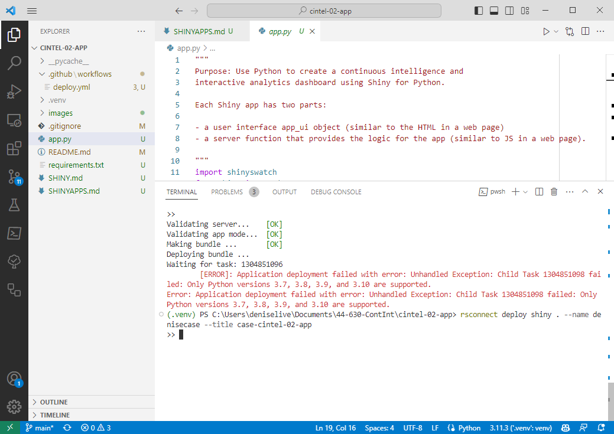
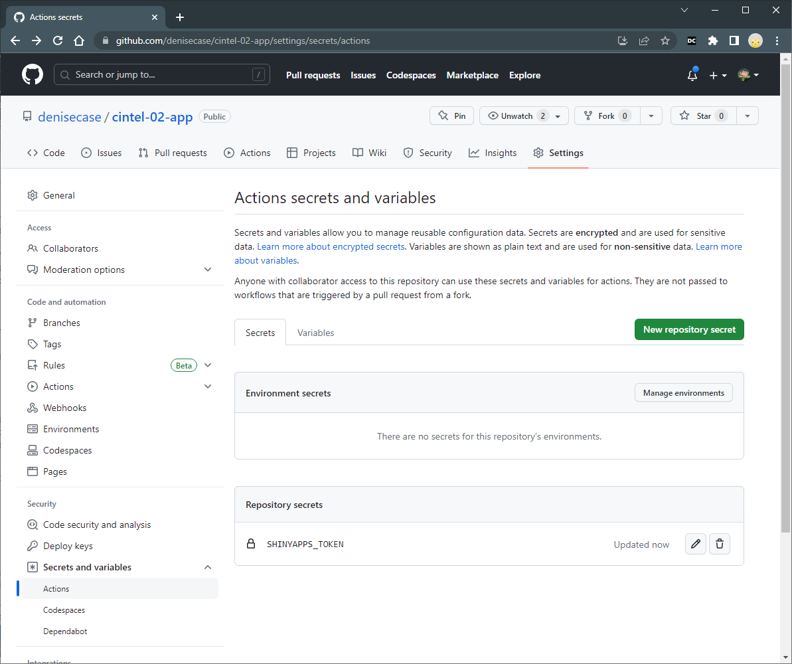
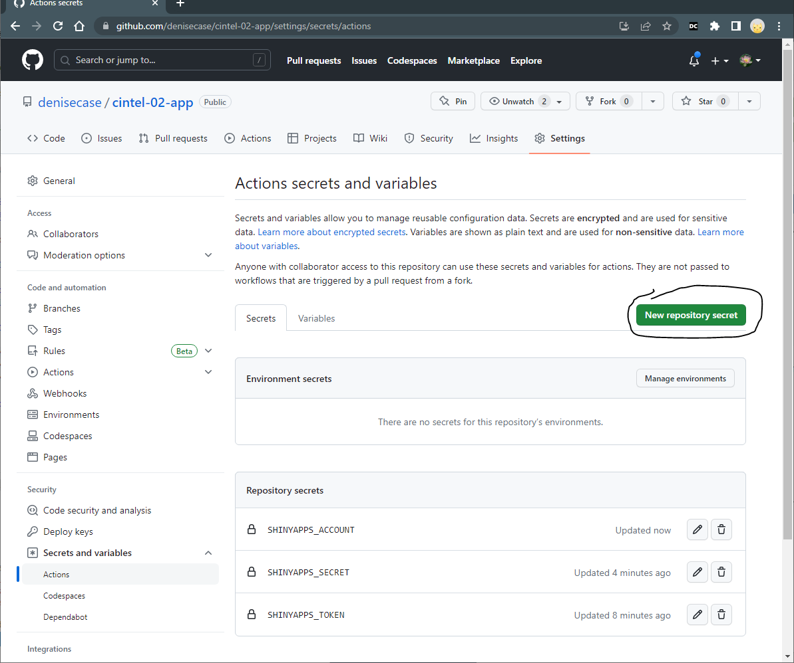
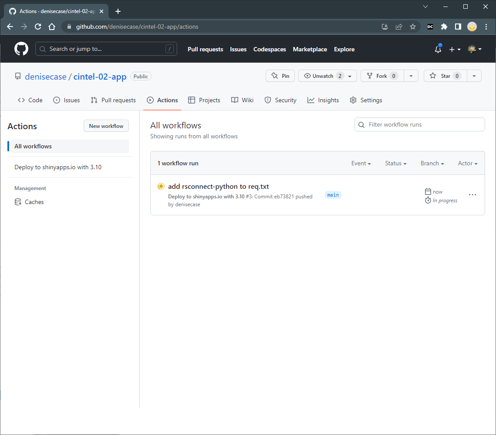
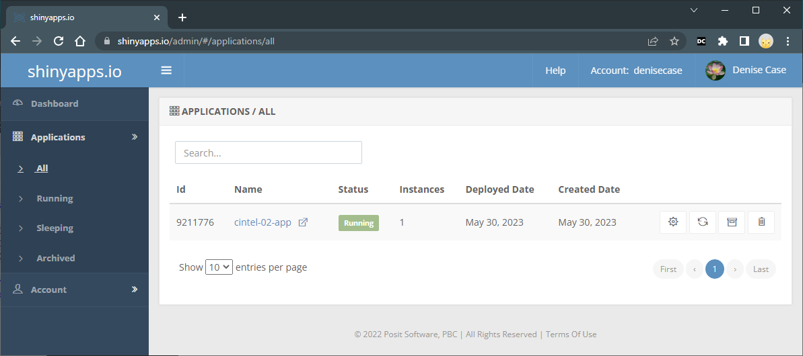

# Deploy a Shiny App to shinyapps.io

We'll deploy the app to [shinyapps.io](http://www.shinyapps.io/) by running a command in the VS Code Terminal.

- If a local app is already running, that terminal window is busy and can't be used for additional commands. 
- In the VS Code Terminal, close/kill the terminal window running your local app. 
- Use Terminal / New Terminal to open a new Terminal window.  
- In the command below, the dot (.) means "this folder here".

TODO: Change this Markdown file to reflect your username instead of denisecase.

```shell
rsconnect deploy shiny . --name denisecase --title cintel-02-app
```

I run Python 3.11 on my machine - but shinyapps.io only supports 3.10, so I got the following **error** when trying to deploy with the command.




## Python Version Issues

Shinyapps.io currently supports Python 3.10 but not 3.11. 
I don't want to install 3.10 on my machine and it's already available on shinyapps.io, 
so I'm going to just configure the deployment to use 3.10. 
I'm not using any Python 3.11 features, so this should work fine.

I created a file named [.github/workflows/deploy.yml](.github/workflows/deploy.yml) to 
automatically deploy my app to shinyapps.io when I push changes to GitHub. 
In the file, I specify the Python version to use for deployment, 
install the packages I need, and deploy the app.

It's not hard, but we must configure some GitHub **secrets** to make it work.

## Set shinyapps Secrets in GitHub

We have to get our secrets from shinyapps.io and add them to GitHub.

Login to [shinyapps.io](http://www.shinyapps.io/). Go to Account / Tokens.
You'll need three secrets:

- The Token
- The Secret (click Show / With Python tab / Show Secret)
- Your shinyapps.io account name (upper right by your profile)

Keep it open. We'll need to paste those values into GitHub.

Login to GitHub and go to your repository. 
On the right, click on Settings tab / 'Secrets and variables' / Actions.
Use the green "New repository secret" button to add 3 secrets.



- Name: SHINYAPPS_TOKEN
- Secret:  (paste the token from shinyapps.io)

- Name: SHINYAPPS_SECRET
- Secret: (paste the secret from shinyapps.io)

- Name: SHINYAPPS_ACCOUNT
- Secret: Paste or type your shinyapps.io account name.


When you finish, your GitHub secrets should look like the following.



## GitHub Actions

After any commit and push to the main branch of the GitHub repository,
GitHub Actions will automatically deploy the app to shinyapps.io.
We can watch the progress in the GitHub **Actions** tab of the repository.
When it ends green, you know it worked. If it ends red, you'll need to fix something.



## Deployed App in shinyapps.io

If the GitHub action completes successfully, the app was deployed to shinyapps.io. 
Log in to [shinyapps.io](https://www.shinyapps.io/) to verify. 



🚀 Rocket Tip: If you have any old apps that didn't deploy (or when you're done with an app) first **archive** the app, then **delete** it. 
We get 5 apps free with the [free plan](https://www.shinyapps.io/#pricing-anchor).

-----

## ⚠️ Delete Hosted App Before Pushing to GitHub

The GitHub action deploy.yml does not automatically delete an existing app from shinyapps.io so we can redeploy.

Before pushing to GitHub, login to [shinyapps.io](https://www.shinyapps.io/) and view the list of applications. 

- First archive the app.
- Then delete the archived app.
